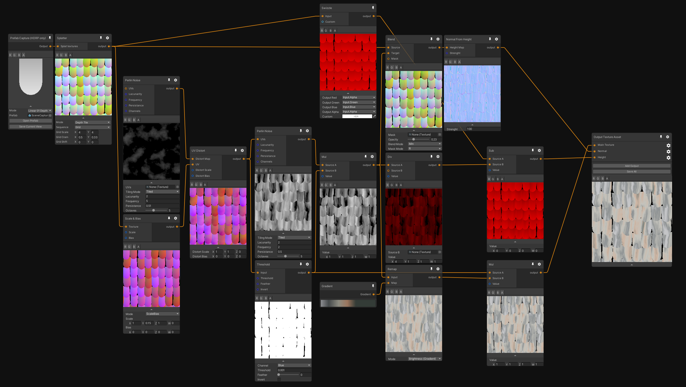
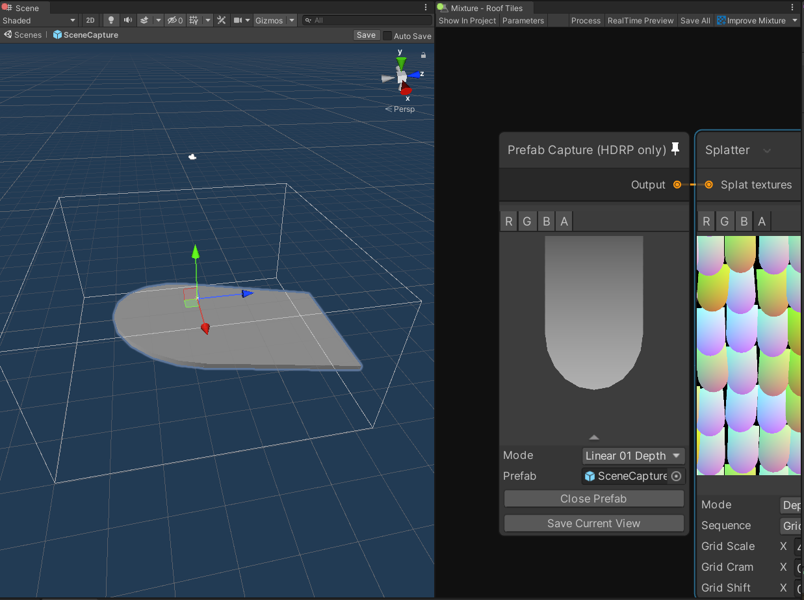
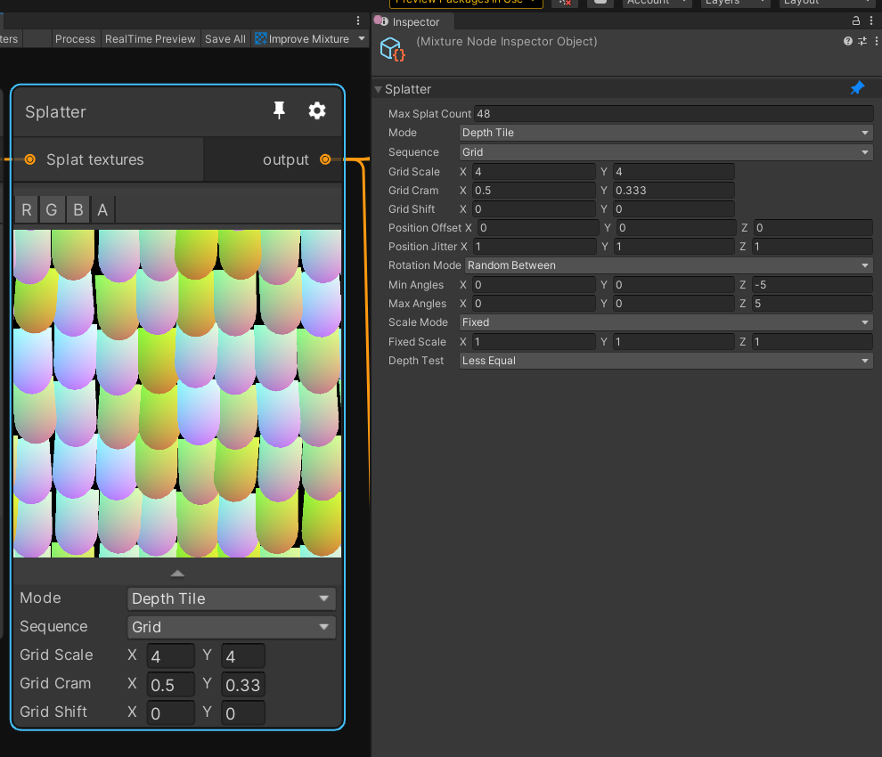
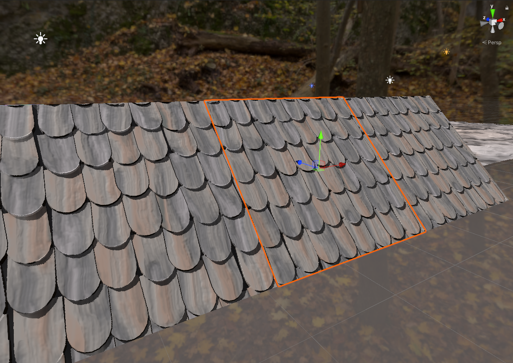
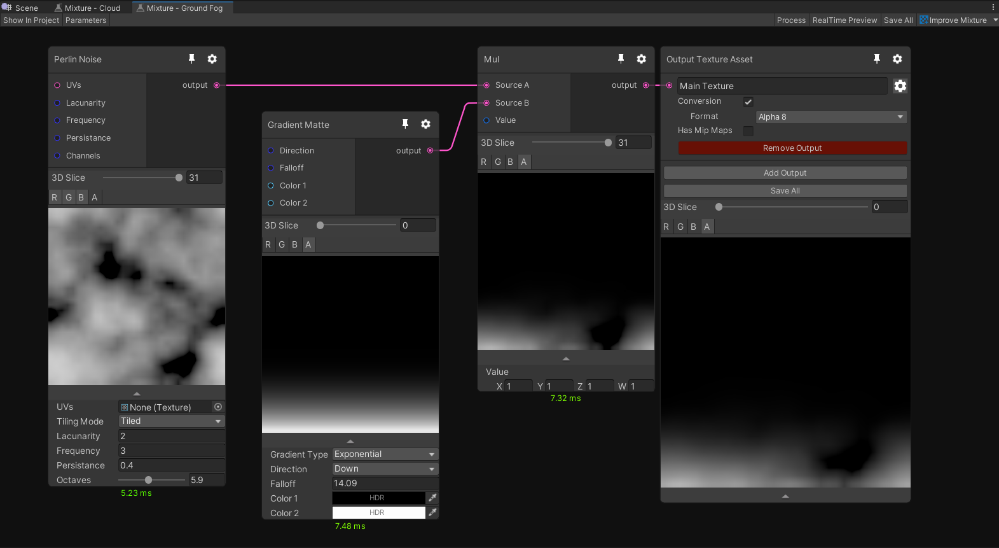

# Examples

You can find all those examples in the samples of the Mixture package. To import them in your project, open the package manager, find the mixture package and import the sample named "Examples".

## Procedural Marble Texture

Tileable marble texture, generated from distorted 2D perlin as a base to get a nice marble pattern, then we generate a "crack" pattern from a Ridged cellular noise and blend the two.

## Roof tiles from geometry

In this example, we're using the very interesting prefab capture node. In this example I'm using it to generate the depth map of a wooden roof tile shape which is the base of our texture, note that this node requires HDRP and if you can't afford it, you can still create a texture like this from your preferred texture editing tool.

Here's a view of the prefab used to render the depth of the tile. I simply used a cylinder and a stretched cube to create this tile, then tilted it to have a gradient in the tile.

The next we have the Splatter node which is configured in **Depth Tile** mode, which means it will output the UVs in the RG channels, a random color in B and the original depth in A which gives us this weird looking tiled texture. Note that in depth tile mode, the node use a depth map to render the different tiles and avoid blending between multiple tiles, the compare function of the depth map can be configures in the editor.

For our roof example, a simple grid patter with some position jitter and random rotation will do:

Then if we skip the next nodes where we manipulate the UVs, we have the **Perlin Noise** node used to add extra details of the wood to our tiles. The interesting bit here is that we use the blue channel of the UVs to as a seed for the noise, which allows us to generate a different noise per tile instead of having the same noise for each tile.

After this, the rest of the graph is some texture manipulation and transformation to output the height, normal and albedo textures.

Here's the result in the scene view:

## HDRP Density Volume Authoring

Ground for example generated by simply multiplying a 3D gradient with a 3D tileable perlin noise:

Here's the result with a [Density Volume](https://docs.unity3d.com/Packages/com.unity.render-pipelines.high-definition@latest/index.html?subfolder=/manual/Density-Volume.html).

And here's another example, this time with a cloud:

This is the result in the scene view:

For the cloud, I mainly use the UV distort noise to create the cloud turbulence with a mask I generate from a first Gradient Matte for the spherical mask and a second one for the "bottom" of the cloud. Then I combine the two with a Mul and use a Texture Sample node with the distorted UVs to create the final cloud.

Note that in the scene, I decreased a bit the `Fog Distance` parameter of the density volume to get this nice "opaque" cloud effect.